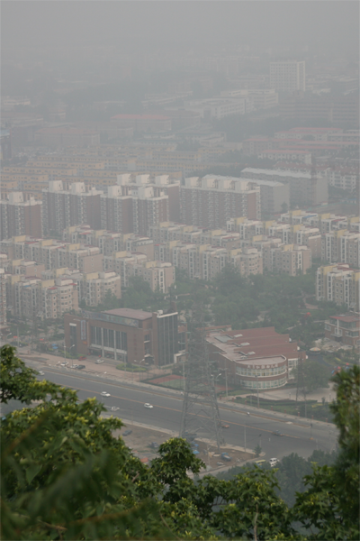
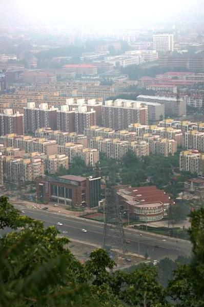

# Dehaze-Algorithms
Recurrent Some Dehazing Algorithms

## Kaiming_Algorithm
*Single Image Haze Removal Using Dark Channel Prior*, Kaiming He, Jian Sun, and Xiaoou Tang, in CVPR 2009

* MATLAB Code
* Shematic diagrams:

* Different from the paper, where atmospheric light **A** is estimated using the pixels with highest intensity in the input image among 0.1% brightest in the dark channel, we first find the 0.1% brightest ones in the dark channel, then pick up 20% with highest intensity and average them. We believe it can make the atmospheric light more robust.
* We calculate `min(x)` in local patch by erosion opration with a `15x15` windows, while guided filter is with `patchsize = 15*4+1=61` .

